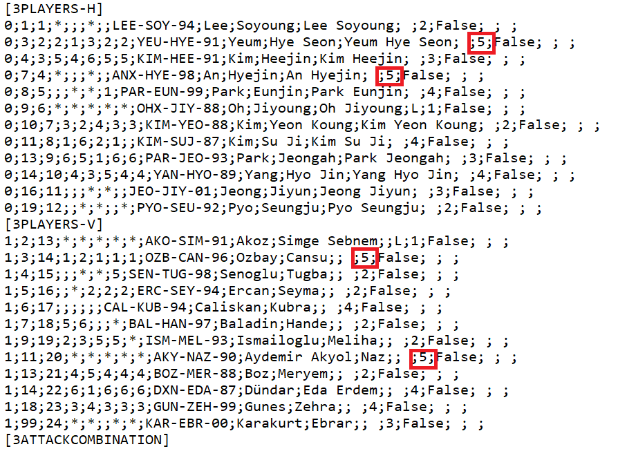
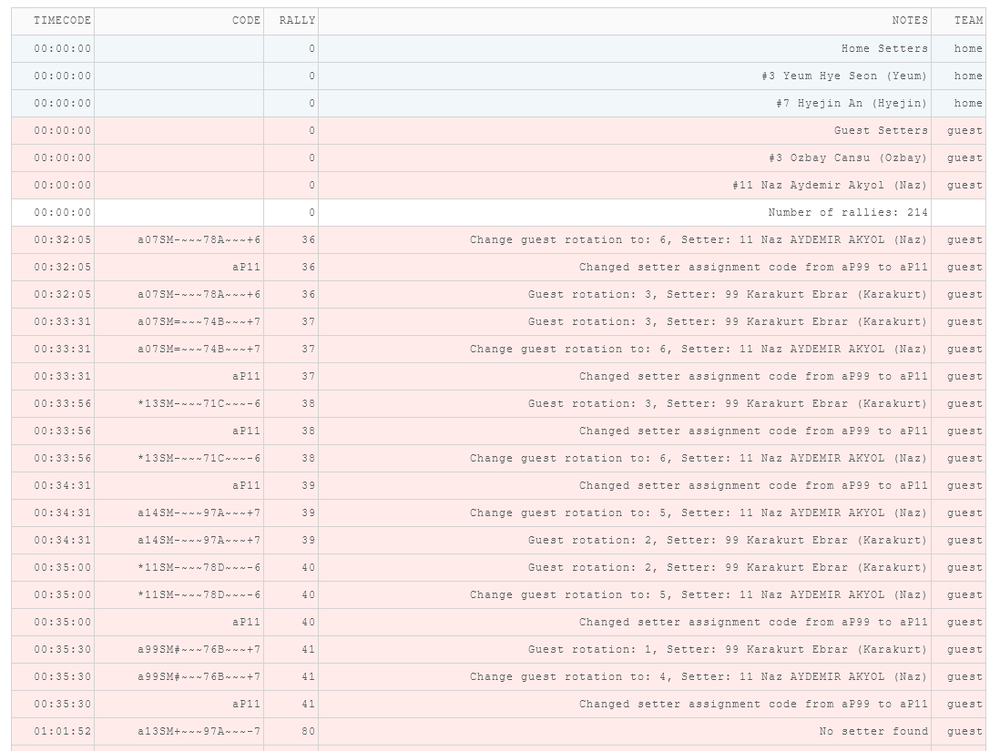
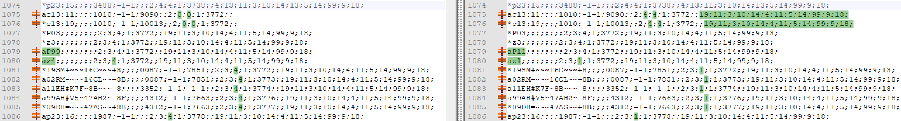

# DoubleSubstitution

This is an app developed with [**Dash**](https://dash.plotly.com/) and deployed on [**Heroku**](https://www.heroku.com/home).

The app performs ***rotation swaps*** when incorrect double substitution are detected.

Link to the app: https://andrea-dvw-2xfix.herokuapp.com/

## How to use the DoubleSubstitution app

### Step 1
Make sure that the setters of each team are marked with "5" in your dvw scout file (see image below).

### Step 2
Drag and drop the file in the app

### Step 3
Download the corrected file from the app

## Additional notes
### Check the log on the app to see what's changed (optional)

### Compare the old file to the new file to verify the changes (optional)

## What is a double-substitution in volleyball
When the setter and opposite in the court are substituted with the second opposite and the second setter respectively, the substitution is called *double substitution*.

## Two approaches for double substitutions
In general, the substitution follows this pattern:
- Setter 1 (out) for Opposite 2 (in)
- Opposite 1 (out) for Setter 2 (in)

In DataVolley files, there are two approaches to perform a double-substitution:
1. Maintain the previous setter rotation, i.e., the rotation is the previous court position of Setter 1
2. Swap the setter rotation, i.e., the new Setter 2 court position becomes the current rotation

For several reasons, I prefer solution 2 (swapping the setter position). For example, if the setter rotation was 1, after a double substitution the setter rotation should become 4, and so on.

***This app performs rotation swap (codes \*z and az), new setter assignments (codes \*P and aP), and setter sets correction (setter codes E).***

